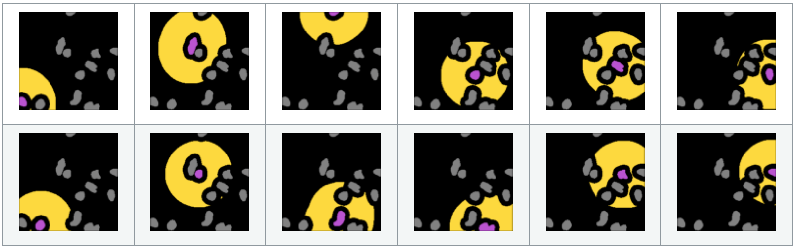

# SegmentationTools.jl

| **Documentation**                 | **Build Status**                                              |
|:----------------------------------|:--------------------------------------------------------------|
| [![][docs-dev-img]][docs-dev-url] | [![][status-img]][status-url] [![][travis-img]][travis-url] [![][codecov-img]][codecov-url] |

Various helper functions for cell segmentation and validation

</img>

## Features

* Local background subtraction
* Flatfield correction
* Creation of grid of segmented objects for diagnosis
* `trackpy` dataframe construction

## Installation

Until this package is registered, the easiest way to install is running the
following command in the Julia REPL:

```julia
] dev https://github.com/tlnagy/SegmentationTools.jl.git
```

[docs-dev-img]: https://img.shields.io/badge/docs-dev-blue.svg
[docs-dev-url]: https://tamasnagy.com/SegmentationTools.jl/dev

[travis-img]: https://travis-ci.com/tlnagy/SegmentationTools.jl.svg?branch=master
[travis-url]: https://travis-ci.com/tlnagy/SegmentationTools.jl

[codecov-img]: https://codecov.io/gh/tlnagy/SegmentationTools.jl/branch/master/graph/badge.svg
[codecov-url]: https://codecov.io/gh/tlnagy/SegmentationTools.jl

[status-img]: https://www.repostatus.org/badges/latest/wip.svg
[status-url]: https://www.repostatus.org/#wip
